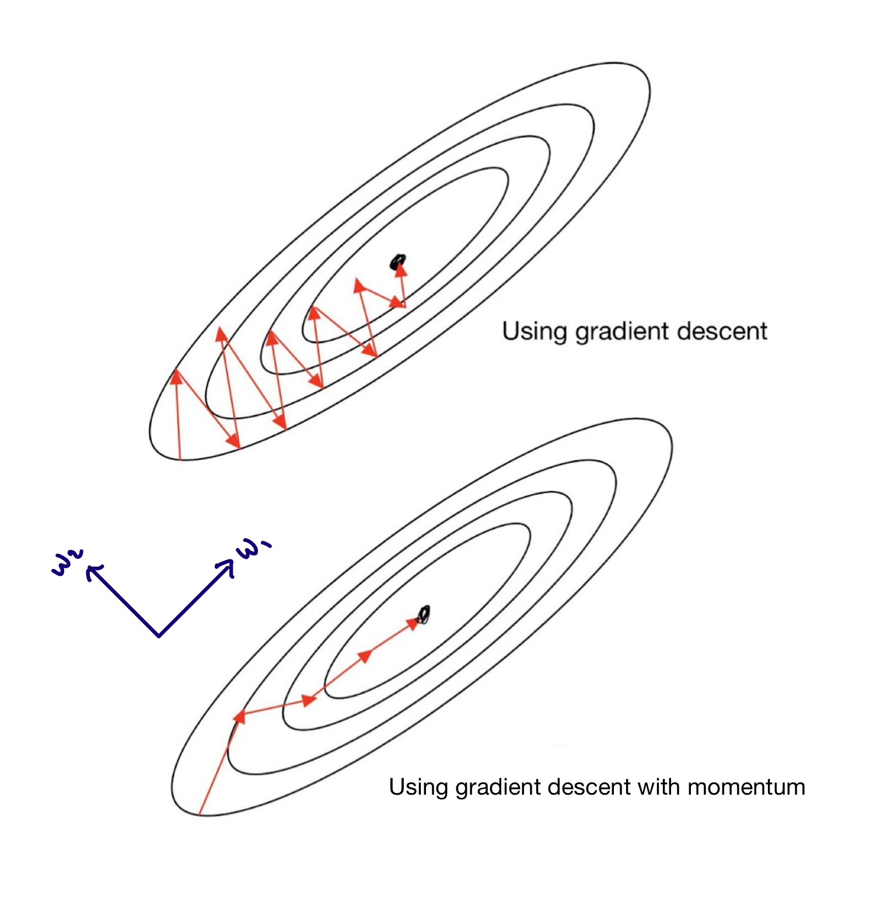

# Why Bother Learning About Different Optimizers?
Formulating Neural Networks involves the critical step of optimizing the weights that make up the model. To do so, an appropriate loss function is used to model the error between the current set of weights and the ideal set of weights that correctly classifies the set of independent variables. This loss function is then minimized to get the optimal set of weights.

There are many ways to minimize a function. Traditionally, in a non-machine learning context, we would use partial derivatives to find the local minima. However, the usage of this method only works consistently with convex functions. Other complicated concepts have to be used to find the minima of non-convex functions. Thus, this method is not a one size fits all solution.

In the machine learning context, a more foolproof method would be iterative algorithms such as gradient descent. Falling under the group of optimizers, there are several commonly used algorithms. Of these the most widely preferred and used optimizer is Adam. In this tutorial, we will explore how Adam optimizer works.

In order to understand Adam we first have to understand some of the other optimizers.

# Outline:
1. Theory Behind Each Optimizer
2. Application in R: Character Recognition of Digits in the MNIST Dataset
3. Test Results & Conclusions
4. Thank you!
5. Sources

## 1. Theory Behind Each Optimizer
### 1.1 Gradient Descent Algorithm
The gradient descent algorithm should be familiar to the majority of students in the course as it was presented in week 3. For each dimension, the algorithm updates the weights according to the following formula.

#### a) Calculating and updating weights of Neural Network:
- $\omega_i$: dimension
- $\alpha$: learning rate
- $L$: loss function

$$
\begin{align*}
  \omega_1 &\leftarrow \omega_1 - \alpha \frac{dL}{d\omega_1} \\
  \omega_2 &\leftarrow \omega_2 - \alpha \frac{dL}{d\omega_2}
\end{align*}
$$

If the gradient is negative, a step is taken in the direction of the gradient and vice versa. The size of the step taken to update the weights is determined by the learning rate.

#### Limitations of Gradient Descent:
- The standard Gradient Descent algorithm is an optimizer which is not _adaptive_. This means that in the the learning rate hyperparameter has to be set and the model would then have to be trained. If the model does not yield good results, the learning rate would have to be altered in a new formulation of the Neural Network and the model would have to be trained again until obtaining satisfactory results. As such, in a large dataset, the training time for a model could take a large amount of time. As such, _adaptive optimizers_ were created where the algorithms would change in subsequent iterations while training the model.
- Additionally, the Gradient Descent algorithm takes an unnecessarily long time to converge. This is due to the algorithm taking an equally large step in all of its dimensions which could lead to the progression of each search oscillating around the search space based on the gradient. 

### 1.2 Gradient Descent with Momentum Algorithm
An adaptation to the previous algorithm is the Gradient Descent with Momentum algorithm. Momentum refers to the inclusion of an additional hyperparameter, $\beta$, which controls the amount of past gradients to include in the updating of Neural Network weights. This is also known as a weighted average of gradients. The addition of momentum intends to accelerate the search in the relevant direction and dampen oscillations within the search space. Subsequently, the weights are updated based on a product of the weighted averages and the learning rate.

#### a) Calculating and updating weighted averages:
- The following equations shows how the weighted average of gradients in each dimension is updated in the Gradient Descent with Momentum algorithm
- $v_{d\omega_i}$: the weighted average of gradients for the Gradient Descent with Momentum algorithm
- $\beta_1$: parameter that determines ratio between past gradients and new gradients between [0,1] for the Gradient Descent with Momentum algorithm

$$
\begin{align*}
  v_{d\omega_1} &\leftarrow \beta_1 v_{d\omega_1} + (1-\beta_1)\frac{dL}{d\omega_1} \\
  v_{d\omega_2} &\leftarrow \beta_1 v_{d\omega_2} + (1-\beta_1)\frac{dL}{d\omega_2}
\end{align*}
$$

#### b) Calculating and updating weights of Neural Network:
- The following set of equations show how the weighted average of gradients in each dimension is used in subsequent updating of weights along with learning rate, $\alpha$.
- $\alpha$: learning rate

$$
\begin{align*}
  \omega_1 &\leftarrow \omega_1 - \alpha V_{d\omega_1} \\
  \omega_2 &\leftarrow \omega_2 - \alpha V_{d\omega_2}
\end{align*}
$$

In the dimension that is not towards the local minima, the weighted average of the gradients will give an extremely small number as it averages a positive and a negative number. However, in dimension towards the minima, the weighted average of the gradients will give a large negative number as it averages two negative numbers. The image below depicting a convex bowl function should help with understanding this concept. Effectively, this causes the learning rate to be adaptive to be faster in the dimension towards the minima and slower in the other.

```{r, echo = FALSE, fig.align = 'center', fig.cap = "Adapted Images for Gradient Descent and Gradient Descent with Momentum Comparison obtained from https://hasty.ai/content-hub/mp-wiki/solvers-optimizers/rmsprop"}

```

### 1.3 Root Mean Square Propogation (RMSProp)
The RMSProp algorithm uses a slightly different method to the Gradient Descent with Momentum algorithm in calculating weighted average of gradients and subsequently updating the weights of the Neural Network. However, the intended outcome on the learning rate is similar in causing the learning rate to be adaptive and faster in the dimension towards the minima and slower in the other.

#### a) Calculating and updating weighted averages
- The following equation shows how the weighted average of gradients in each dimension is updated in the RMSProp algorithm
- $S_{d\omega_i}$: weighted average of gradients for RMSProp algorithm
- $\beta_2$: parameter that determines ratio between past gradients and new gradients between [0,1] for the RMSProp algorithm

$$
\begin{align*}
  S_{d\omega_1} &\leftarrow \beta_2 S_{d\omega_1} + (1-\beta_2)(\frac{dL}{d\omega_1})^2 \\
  S_{d\omega_2} &\leftarrow \beta_2 S_{d\omega_2} + (1-\beta_2)(\frac{dL}{d\omega_2})^2 \\
\end{align*}
$$
Note the first difference between the RMSProp and Gradient Descent with Momentum optimizers is that the gradient used in calculating the weighted averages is squared.

#### b) Calculating and updating weights of Neural Network:
- The second set of equations show how the weighted average of gradients in each dimension is used in subsequent updating of weights along with learning rate, $\alpha$:
- $\epsilon$: stabilising constant to prevent gradients from exploding when the denominator is extremely small. Typically takes value of $10^{-8}$

$$
\begin{align*}
  \omega_1 &\leftarrow \omega_1 - \alpha \frac{(\frac{dL}{d\omega_1})}{\sqrt{S_{d\omega_1}} + \epsilon} \\
  \omega_2 &\leftarrow \omega_2 - \alpha \frac{(\frac{dL}{d\omega_2})}{\sqrt{S_{d\omega_2}} + \epsilon}
\end{align*}
$$
Here, the second difference between the RMSProp and Gradient Descent with Momentum optimizers is in the updating of weights of the Neural Network. These are 2 different calculations of updating the Neural Network weights intended to cause the convergence of the algorithm to occur faster.

### 1.4 Adaptive Moment Estimation (Adam)
The Adam algorithm is a combination of the Gradient Descent with Momentum and RMSProp algorithms. Note that in the Gradient Descent with Momentum algorithm and the RMSProp algorithm, the calculations of weighted averages of gradients are denoted by $V_{d\omega_i}$ and $S_{d\omega_i}$ respectively while the ratio between past gradients and new gradients is also denoted by $\beta_1$ and $\beta_2$ respectively. This is intentional as the aggregation of the 2 algorithms in the Adam algorithm utilizes both methods of calculating the weighted averages of gradients.

#### a) Calculating RMSProp and Gradient Descent with Momentum weighted averages:
- $V_{d\omega_i}$: the weighted average of gradients for the Gradient Descent with Momentum algorithm
- $S_{d\omega_i}$: weighted average of gradients for RMSProp algorithm
- $\beta_1$: parameter that determines ratio between past gradients and new gradients between [0,1] for the Gradient Descent with Momentum algorithm
- $\beta_2$: parameter that determines ratio between past gradients and new gradients between [0,1] for the RMSProp algorithm

$$
\begin{align*}
  V_{d\omega_1} &\leftarrow \beta_1 V_{d\omega_1} + (1-\beta_1)\frac{dL}{d\omega_1} \\
  V_{d\omega_2} &\leftarrow \beta_1 V_{d\omega_2} + (1-\beta_1)\frac{dL}{d\omega_2} \\
  S_{d\omega_1} &\leftarrow \beta_2 S_{d\omega_1} + (1-\beta_2)(\frac{dL}{d\omega_1})^2 \\
  S_{d\omega_2} &\leftarrow \beta_2 S_{d\omega_2} + (1-\beta_2)(\frac{dL}{d\omega_2})^2 \\
\end{align*}
$$

However, the terms $V_{d\omega_i}$ and $S_{d\omega_i}$ are all initialized to 0 and the terms $\beta_1$ and $\beta_2$ are set to be close to 1. As such, the algorithm would be biased towards 0 in the first few updates. Hence, the Adam algorithm implements bias correction in each iteration, $t$, to overcome this initial bias which is towards 0. This is an additive feature of the Adam algorithm that the other algorithms from 1.1 to 1.3 do not implement. 

#### b) Bias correction of weighted averages:
- $V_{d\omega_i}^{\text{corrected}}$: bias corrected weighted average of gradients between [0,1] for the Gradient Descent with Momentum algorithm
- $S_{d\omega_i}^{\text{corrected}}$: bias corrected weighted average of gradients between [0,1] for the RMSProp algorithm
- $t$: iteration number

$$
\begin{align*}
  V_{d\omega_1}^{\text{corrected}} &= \frac{V_{d\omega_1}}{1-\beta_1^t} \\
  V_{d\omega_2}^{\text{corrected}} &= \frac{V_{d\omega_2}}{1-\beta_1^t} \\
  S_{d\omega_1}^{\text{corrected}} &= \frac{S_{d\omega_1}}{1-\beta_2^t} \\
  S_{d\omega_2}^{\text{corrected}} &= \frac{S_{d\omega_2}}{1-\beta_2^t}
\end{align*}
$$

#### c) Calculating and updating weights of Neural Network:
- $\epsilon$: stabilising constant to prevent gradients from exploding when the denominator is extremely small. Typically takes value of $10^{-8}$
- $\alpha$: learning rate

$$
\begin{align*}
  \omega_1 &\leftarrow \omega_1 - \alpha \frac{V_{d\omega_1}^{\text{corrected}}}{\sqrt{S_{d\omega_1}^{\text{corrected}}} + \epsilon} \\
  \omega_2&\leftarrow \omega_2 - \alpha \frac{V_{d\omega_2}^{\text{corrected}}}{\sqrt{S_{d\omega_2}^{\text{corrected}}} + \epsilon}
\end{align*}
$$

As seen in the prior equations explaining the functionality of the Adam algorithm, the combination of Gradient Descent with Momentum and RMSProp algorithm's calculations for weighted averages of gradients and further bias correction for each of these terms intends to cause the Adam algorithm to converge even faster as the starting point for learning is not biased towards 0. As such, the Adam algorithm was theorized by researchers to be the best adaptive optimizer.

To emphasize that these algorithms are indeed different, we found this interesting animation which shows the different paths taken by different optimizers in reaching a minimum point. Here, we note that different algorithms may result in finding different minimas and the time taken to reach (or converge towards) these minimas vary greatly from one optimizer to another. This is purely hypothetical and hence we can proceed to conduct some tests to see whether a similar phenomenon occurs in practice.
```{r, fig.align = 'center', echo = FALSE, fig.cap = "Animation showcasing different optimizer's path towards the minima obtained from https://awesomeopensource.com/project/Jaewan-Yun/optimizer-visualization"}
knitr::include_graphics('./allopti.gif')
```

## 2. Application in R: Character Recognition of Digits in the MNIST Dataset
A common application of Neural Networks is in the field of image recognition. To compare the respective models compiled with different optimizers, we will perform a simple character recognition activity to measure the performance of these models in classifying digits from the popular MNIST dataset. The performance will be based on the time taken to train the model and the prediction accuracy on the test set. _Let's see if the model compiled with the Adam optimizer comes out on top..._ 

### 2.1 Import required libraries

```{r, echo = TRUE, warning = FALSE, message = FALSE}
library(keras) # to import dataset and create artificial neural netwokrs
library(tidyr) # to wrangle data
library(dplyr) # to wrangle data
library(stringr) # to wrangle data (specifically strings)
library(knitr) # to create nice tables in html_output, add images into html_output
```

### 2.2 Data wrangling
#### a) Utilize Keras inbuilt MNIST dataset
```{r, echo = TRUE, warning = FALSE, message = FALSE, eval = FALSE}
MNIST <- dataset_mnist()
```

#### b) Extract x (feature variables) and y (response variables)
```{r, echo = TRUE, warning = FALSE, message = FALSE, eval = FALSE}
x_train <- MNIST$train$x
y_train <- MNIST$train$y
x_test <- MNIST$test$x
y_test <- MNIST$test$y
```

The next step is slightly more difficult to visualize and the following context behind the MNIST x values may be helpful. Once extracted from the MNIST dataset, the x_train values are 60000 28x28 matrices with entries that vary from 0 to 255. View the following matrix of a digit 5 and the corresponding image.
```{r, echo = FALSE, warning = FALSE, message = FALSE}
library(keras)
MNIST <- dataset_mnist()

x_train <- MNIST$train$x
y_train <- MNIST$train$y
x_test <- MNIST$test$x
y_test <- MNIST$test$y

x_train[1,,]
```
```{r, echo = FALSE, warning = FALSE, message = FALSE}
im <- x_train[1,,]
im <- t(apply(im, 2, rev))
image(1:28, 1:28, im)
```

#### c) Reshape: We intend to create a simple Classifier Neural Network rather than a Convolutional Neural Network. As such, we need to provide a row vector as the input. Hence, we reshape the image matrix from 28x28 matrices to 1x784 matrices. 

```{r, echo = TRUE, warning = FALSE, message = FALSE, eval = FALSE}
x_train <- array_reshape(x_train, c(nrow(x_train), 784))
x_test <- array_reshape(x_test, c(nrow(x_test), 784))
```

#### d) Rescale: Values in an image matrix range from 0 to 255. We rescale these values by a factor of 255 so the values are in the range of [0,1].

```{r, echo = TRUE, warning = FALSE, message = FALSE, eval = FALSE}
x_train <- x_train/255
x_test <- x_test/255
```

#### e) Perform one-hot encoding on the y values. Of which, there are 10 classes being digits from 0 to 9.

```{r, echo = TRUE, warning = FALSE, message = FALSE, eval = FALSE}
y_train <- to_categorical(y_train, 10)
y_test <- to_categorical(y_test, 10)
```

### 2.2 General Classifier Neural Network Formulation
#### a) Create sequential model

```{r, echo = TRUE, warning = FALSE, message = FALSE, eval = FALSE}
model_general <- keras_model_sequential()
```

#### b) Add layers: The hidden output layers are standard layers we have seen in class. New layers included are the dropout layers which are added to prevent overfitting.
- 1st hidden layer: 'relu' activation with 256 units
- 1st dropout layer: Dropout rate 0.4 
- 2nd hidden layer: 'relu' activation with 128 units
- 2nd dropout layer: Dropout rate 0.3 
- output layer: 'softmax' activation with 10 units (10 classes of digits between 0 and 9)

```{r, echo = TRUE, eval = FALSE}
model_general %>% 
  layer_dense(units = 256, activation = 'relu', input_shape = c(784)) %>% 
  layer_dropout(rate = 0.4) %>% 
  layer_dense(units = 128, activation = 'relu') %>%
  layer_dropout(rate = 0.3) %>%
  layer_dense(units = 10, activation = 'softmax')
```

#### c) Compile model
- loss function: **categorical_crossentropy** loss for one-hot encoded labels
- optimizer: we vary this based on the test run. For our tests, we use **optimizer_sgd()** for Gradient Descent with and without Momentum, **optimizer_rmsprop()** for Root Mean Square Propogation and  **optimizer_adam()** for Adaptive Moment Estimation. For this general model, we will set the optimizer as optimizer_adam()
- metrics: accuracy
```{r, echo = TRUE, warning = FALSE, message = FALSE, eval = FALSE}
model_general %>% compile(
  loss = 'categorical_crossentropy',
  optimizer = optimizer_adam(),
  metrics = c('accuracy')
)
```

#### d) Next, we fit the model
- epochs: 300 
- batch size: 128 due to the large size of the dataset.
- The starting time and end time is added to track the time taken to fit the respective models
```{r, echo = TRUE, warning = FALSE, message = FALSE, eval = FALSE}
start_time <- Sys.time()
history_general <- model_general %>% fit(
  x_train, y_train, 
  epochs = 300, batch_size = 128, 
  validation_split = 0.2
)
end_time <- Sys.time()
time_taken <- end_time - start_time
```

#### e) Finally, we evaluate the performance of the model on the test set.
```{r, echo = TRUE, warning = FALSE, message = FALSE, eval = FALSE}
accuracy <- model_general %>%
  evaluate(x_test, y_test)
```

### 2.3 Model Creation
Next, we create the models by varying optimizers in step (c). Later on in section 3, we would compare the performance of the models based on training speed and prediction accuracy. 

#### a) Gradient Descent Optimizer
Here, we create **model_gd**. The optimizer selected is **optimizer_sgd()** with default inputs. However, tweaking some of the input parameters could alter the model. 3 of the most important inputs are as follows. Firstly, **learning_rate** can be set which was previously defined in the theory section as $\alpha$. Secondly, **momentum** can be set to formulate the optimizer as a gradient descent with momentum (more on this later on). Thirdly, **decay** can be set to cause the learning rate to decay over each update.

```{r, echo = TRUE, warning = FALSE, message = FALSE, eval = FALSE}
model_gd <- keras_model_sequential() 
model_gd %>% 
  layer_dense(units = 256, activation = 'relu', input_shape = c(784)) %>% 
  layer_dropout(rate = 0.4) %>% 
  layer_dense(units = 128, activation = 'relu') %>%
  layer_dropout(rate = 0.3) %>%
  layer_dense(units = 10, activation = 'softmax')

model_gd %>% compile(
  loss = 'categorical_crossentropy',
  optimizer = optimizer_sgd(), #gradient descent (without momentum)
  metrics = c('accuracy')
)
start_time <- Sys.time()
history_gd <- model_gd %>% fit(
  x_train, y_train, 
  epochs = 300, batch_size = 128, 
  validation_split = 0.2,
  verbose = 0
)
end_time <- Sys.time()

time_taken <- end_time - start_time

accuracy <- model_gd %>% 
  evaluate(x_test, y_test)
```

#### b) Gradient Descent with Momentum Optimizer
Here, we create **model_gdmom**. The optimizer selected is similar to **model_gd** which is **optimizer_sgd()**. However, the default value of momentum is 0 when using **optimizer_sgd()**. Hence, to apply momentum in this model, we set the **momentum** parameter in **optimizer_sgd()** to be 0.9. This parameter can take any value between 0 and 1 but a common application is to use a value close to 1. If one intends to train a model with a higher weightage to the previous gradients, a higher momentum value can be chosen.

```{r, echo = TRUE, warning = FALSE, message = FALSE, eval = FALSE}
model_gdmom <- keras_model_sequential() 
model_gdmom %>% 
  layer_dense(units = 256, activation = 'relu', input_shape = c(784)) %>% 
  layer_dropout(rate = 0.4) %>% 
  layer_dense(units = 128, activation = 'relu') %>%
  layer_dropout(rate = 0.3) %>%
  layer_dense(units = 10, activation = 'softmax')

model_gdmom %>% compile(
  loss = 'categorical_crossentropy',
  optimizer = optimizer_sgd(momentum = 0.9), #gradient descent with momentum
  metrics = c('accuracy')
)
start_time <- Sys.time()
history_gdmom <- model_gdmom %>% fit(
  x_train, y_train, 
  epochs = 300, batch_size = 128, 
  validation_split = 0.2,
  verbose = 0
)
end_time <- Sys.time()

time_taken <- end_time - start_time

accuracy <- model_gdmom %>% 
  evaluate(x_test, y_test)
```

#### c) RMSProp Optimizer

Here, we create **model_rmsp**. The optimizer selected is **optimizer_rmsp()** with default inputs. There are 2 main input parameters to the optimizer. Firstly, **learning_rate** can be set which was previously defined in the theory section as $\alpha$. Secondly, **rho**, also known as decay factor, can be set to cause the learning rate to decay over each update.
```{r, echo = TRUE, warning = FALSE, message = FALSE, eval = FALSE}
model_rmsp <- keras_model_sequential() 
model_rmsp %>% 
  layer_dense(units = 256, activation = 'relu', input_shape = c(784)) %>% 
  layer_dropout(rate = 0.4) %>% 
  layer_dense(units = 128, activation = 'relu') %>%
  layer_dropout(rate = 0.3) %>%
  layer_dense(units = 10, activation = 'softmax')

model_rmsp %>% compile(
  loss = 'categorical_crossentropy',
  optimizer = optimizer_rmsprop(), #RMSProp
  metrics = c('accuracy')
)
start_time <- Sys.time()
history_rmsp <- model_rmsp %>% fit(
  x_train, y_train, 
  epochs = 300, batch_size = 128, 
  validation_split = 0.2,
  verbose = 0
)
end_time <- Sys.time()

time_taken <- end_time - start_time

accuracy <- model_rmsp %>% 
  evaluate(x_test, y_test)
```

#### d) Adam Optimizer
Lastly, we create **model_adam**. The optimizer selected is **optimizer_adam()** with default inputs. There are 2 main input hyperparameters to the optimizer. Firstly, **beta_1** adjusts the $\beta$ used in the calculations for Gradient Descent with Momentum ($V_{d\omega_i}$).  Secondly, **beta_2** adjusts the $\beta$ used in the calculations for RMSProp ($S_{d\omega_i}$).

```{r, echo = TRUE, warning = FALSE, message = FALSE, eval = FALSE}
model_adam <- keras_model_sequential() 
model_adam %>% 
  layer_dense(units = 256, activation = 'relu', input_shape = c(784)) %>% 
  layer_dropout(rate = 0.4) %>% 
  layer_dense(units = 128, activation = 'relu') %>%
  layer_dropout(rate = 0.3) %>%
  layer_dense(units = 10, activation = 'softmax')

model_adam %>% compile(
  loss = 'categorical_crossentropy',
  optimizer = optimizer_adam(), #Adam
  metrics = c('accuracy')
)

start_time <- Sys.time()
historyadam <- modeladam %>% fit(
  x_train, y_train, 
  epochs = 300, batch_size = 128, 
  validation_split = 0.2,
  verbose = 0
)
end_time <- Sys.time()
accuracy <- model_adam %>% 
  evaluate(x_test, y_test)
```

Now that we have formulated the 4 different Neural Networks, we can compare the performance of these models based on training speed and prediction accuracy on the test set.

### 3. Test Results & Conclusions
To run the code, you may extract the code chunks above in section 2 and run them separately or run the Optimizer Trials.RMD file (takes around 30minutes). However, for this article, we will simply extract the training time and accuracy from the outputs for viewing so that we would not require a large amount of time to compile the notebook. 

```{r, echo = FALSE, results = 'asis'}
models <- c("Gradient Descent", "Gradient Descent with Momentum", "RMSProp", "Adam")
speed <- c("8.927", "7.705", "9.367", "8.65")
accuracy <- c("0.981", "0.9835", "0.979", "0.9833")
speed_rank <- c("3", "1", "4", "2")
accuracy_rank <- c("3", "1", "4", "2")
performance_dt <- data.frame(models, speed, accuracy, speed_rank, accuracy_rank)

names(performance_dt)[names(performance_dt) == "models"] <- "Optimizer"
names(performance_dt)[names(performance_dt) == "speed"] <- "Training Speed (mins)"
names(performance_dt)[names(performance_dt) == "accuracy"] <- "Prediction Accuracy"
names(performance_dt)[names(performance_dt) == "speed_rank"] <- "Speed Ranking"
names(performance_dt)[names(performance_dt) == "accuracy_rank"] <- "Accuracy Ranking"

kable(performance_dt)
```

In conclusion, the theory for the Adam optimizer suggests that it is the most adaptive optimizer of the 4 discussed and hence it should converge the fastest. However, the results do not reflect this as seen by the performance of the Gradient Descent with Momentum algorithm being faster and slightly more accurate. We could attribute this to various reasons such as the nature of the dataset selected for application. Furthermore, the Neural Network implemented is rather shallow with only 2 hidden layers. This may not be optimal when formulating a Neural Network with the Adam optimizer as it has been said to be more useful for formulations of deepnets. 

Looking at the performance of all the optimizers besides the Adam optimizer, a fairly high prediction accuracy is achieved with slight differences in terms of training speeds when trained for 300 epochs. However, just by utilizing the default inputs for the Adam optimizer in formulating a Neural Network, the results are fairly promising as the performance ranks as the second best in terms of training speed and prediction accuracy amongst the discussed optimizers. As such, we would conclude that the Adam optimizer is simple in its application due to the high performance when using default inputs and the rationale for it being such a popular optimizer is justified.

### 4. Thank you!
Thank you for taking the time to read our project! We hope you enjoyed this and learned a thing or two about the different optimizers in Keras as we tried to present all the information clearly and concisely for your understanding :-)

### 5. Sources
- Adapted Drawings for Gradient Descent comparison with Gradient Descent with Momentum (https://hasty.ai/content-hub/mp-wiki/solvers-optimizers/rmsprop)
- MNIST Classification Problem (https://towardsdatascience.com/image-classification-in-10-minutes-with-mnist-dataset-54c35b77a38d)
- Plotting MNIST image matrix in R (https://stackoverflow.com/questions/37953644/r-image-plot-mnist-dataset)
- Gradient Descent Optimizer input parameters (https://keras.rstudio.com/reference/optimizer_sgd.html)
- Root Mean Square Propogation Optimizer input parameters (https://keras.rstudio.com/reference/optimizer_rmsprop.html)
- Adaptive Moment Estimation Optimizer input parameters (https://keras.rstudio.com/reference/optimizer_adam.html)
- Different Optimizer Path Visualization (https://awesomeopensource.com/project/Jaewan-Yun/optimizer-visualization)
- Understanding Difference Between Each Optimizer (https://www.analyticsvidhya.com/blog/2021/10/a-comprehensive-guide-on-deep-learning-optimizers/)


